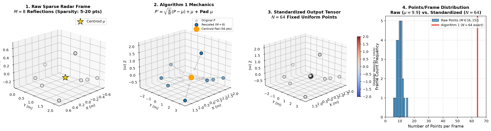

# 📡 TI IWR6843 mmWave Radar Dataset: Interpretation & Processing Guide

This document provides a comprehensive, mathematically rigorous technical guide explaining how raw 4D millimeter-wave (mmWave) radar data from the **TI IWR6843 mmWave Radar Fall Detection Dataset** (60–64 GHz) is interpreted, filtered, labeled, and converted into standardized training tensors across this repository.

---

## 📑 Table of Contents
1. [Sensor Hardware & Raw CSV Data Schema](#1-sensor-hardware--raw-csv-data-schema)
2. [Dataset Hierarchy & Subject Demographics](#2-dataset-hierarchy--subject-demographics)
3. [Outlier Filtering & Spatial Bounding Box](#3-outlier-filtering--spatial-bounding-box)
4. [Algorithm 1: Mean-Preserving Oversampling ($N=64$)](#4-algorithm-1-mean-preserving-oversampling-n64)
5. [Temporal Windowing & Position-Invariant Centering](#5-temporal-windowing--position-invariant-centering)
6. [Class Balancing & Output Tensors](#6-class-balancing--output-tensors)
7. [Downstream Model Representations (Rep 1, 2, 3)](#7-downstream-model-representations-rep-1-2-3)
8. [Trained Baseline Performance](#8-trained-baseline-performance)

---

## 1. Sensor Hardware & Raw CSV Data Schema

The dataset was collected using a **Texas Instruments (TI) IWR6843 mmWave Sensor** operating in the **60–64 GHz** Industrial/Scientific/Medical (ISM) band.

### Hardware Operating Parameters
* **Operating Frequency Band**: $60.0 - 64.0\text{ GHz}$ (FMCW chirps).
* **Frame Rate**: $10\text{ Hz}$ ($100\text{ ms}$ per frame, matching ~25 frames over ~2.5s per trial).
* **Field of View**: $\pm 60^\circ$ azimuth, $\pm 15^\circ$ elevation.
* **Storage Location**: [`datasets/mmwave-radar-fall-detection/GatheredData/`](datasets/mmwave-radar-fall-detection/GatheredData).

### Raw CSV Column Schema
Each motion trial is stored as a discrete CSV file. Every row corresponds to a single radar point reflection detected by the sensor's onboard CFAR (Constant False Alarm Rate) algorithm:

| Column Name | Data Type | Physical Meaning | Valid Range / Unit |
| :--- | :---: | :--- | :--- |
| **`frame`** | Integer | Temporal frame index within the recording | `0 ... 24` (~10 FPS) |
| **`DetObj#`** | Integer | Index of the detected point within the frame | `0 ... M` points |
| **`x`** | Float | 3D Lateral horizontal position in room space | meters ($X \in [-2.0, 2.0]\text{ m}$) |
| **`y`** | Float | 3D Depth distance from the radar antenna | meters ($Y \in [0.0, 6.0]\text{ m}$) |
| **`z`** | Float | 3D Vertical elevation relative to the sensor | meters ($Z \in [-0.5, 2.2]\text{ m}$) |
| **`v`** | Float | Radial Doppler velocity along line-of-sight | m/s ($v \in [-3.0, 3.0]\text{ m/s}$) |
| **`snr`** | Integer | Signal-to-Noise Ratio (reflection confidence) | Raw energy metric ($\ge 100$) |
| **`noise`** | Integer | Ambient background RF noise floor level | Raw noise metric |

---

## 2. Dataset Hierarchy & Subject Demographics

The dataset comprises **102 motion recordings** collected across **3 human subjects** (**Areeb**, **Raffay**, **Towsif**):

```text
datasets/mmwave-radar-fall-detection/GatheredData/
├── Fall/                                      # 51 Fall Recordings (Class 1)
│   ├── Areeb_front_1.csv ... 7.csv            # Front Falls (21 recordings)
│   ├── Raffay_front_1.csv ... 7.csv
│   ├── Towsif_front_1.csv ... 7.csv
│   ├── Areeb_back_1.csv ... 5.csv             # Back Falls (15 recordings)
│   ├── Raffay_back_1.csv ... 5.csv
│   ├── Towsif_back_1.csv ... 5.csv
│   ├── Areeb_side_1.csv ... 5.csv             # Side Falls (15 recordings)
│   ├── Raffay_side_1.csv ... 5.csv
│   └── Towsif_side_1.csv ... 5.csv
│
└── Not/                                       # 51 Non-Fall ADL Recordings (Class 0)
    ├── Areeb_walk_1.csv ... 7.csv             # Normal Walking (21 recordings)
    ├── Raffay_walk_1.csv ... 7.csv
    ├── Towsif_walk_1.csv ... 7.csv
    ├── Areeb_bowing_1.csv ... 5.csv           # Bowing / Bending (15 recordings)
    ├── Raffay_bowing_1.csv ... 5.csv
    ├── Towsif_bowing_1.csv ... 5.csv
    ├── Areeb_squat_1.csv ... 5.csv            # Squatting / Crouching (15 recordings)
    ├── Raffay_squat_1.csv ... 5.csv
    └── Towsif_squat_1.csv ... 5.csv
```

### Motion Categories Breakdown
* **Fall Actions (Class 1)**:
  * **Front Fall**: Subject falls forward onto a protective mat.
  * **Back Fall**: Loss of balance backwards onto the floor.
  * **Side Fall**: Uncontrolled lateral collapse onto left or right side.
* **Non-Fall ADL Actions (Class 0)**:
  * **Walking**: Continuous walking cadence across the field of view.
  * **Bowing / Bending**: Reaching low to the ground and returning to standing posture.
  * **Squatting / Crouching**: Controlled vertical descent to squat and rising again.

---

## 3. Outlier Filtering & Spatial Bounding Box

Implemented in [02_mmwave_radar_fall_detection_data_preparation.ipynb](mmwave-radar-fall-detection/02_mmwave_radar_fall_detection_data_preparation.ipynb):

Radar reflections often capture spurious multipath scattering off side walls, floors, and electrical equipment. The data preparation pipeline applies three deterministic filtering constraints:

1. **SNR Reflection Quality Filter**:
   $$\text{SNR} \ge 100$$
   Eliminates low-confidence specular reflections and weak ghost targets.

2. **Doppler Velocity Sanity Filter**:
   $$|v| \le 3.0\text{ m/s}$$
   Rejects high-frequency multipath velocity artifacts beyond normal human biomechanics.

3. **3D Physical Room Bounding Box**:
   $$X \in [-2.0, 2.0]\text{ m} \quad (\text{Lateral room width})$$
   $$Y \in [0.0, 6.0]\text{ m} \quad (\text{Depth range})$$
   $$Z \in [-0.5, 2.2]\text{ m} \quad (\text{Floor to ceiling})$$

---

## 4. Algorithm 1: Mean-Preserving Oversampling ($N=64$)

In the raw CSV files, the number of detected points per frame fluctuates between 6 and 15 points (mean $\approx 10$ points). To ensure compatible input tensor shapes for convolutional neural networks and PointNet architectures, point clouds are standardized to **$N = 64$ points per frame** using **Algorithm 1**:

* Let $\mathbf{P} = \{\mathbf{p}_1, \dots, \mathbf{p}_M\} \subset \mathbb{R}^4$ be the $M$ valid points in a frame, where each point is $[x, y, z, v]$.
* Compute empirical centroid:
  $$\hat{\mu} = \frac{1}{M} \sum_{i=1}^M \mathbf{p}_i$$
* If $M \ge N$: Retain the first $N$ points.
* If $M < N$: Rescale all original points around the centroid:
  $$\mathbf{p}_i' = \sqrt{\frac{N}{M}} \cdot (\mathbf{p}_i - \hat{\mu}) + \hat{\mu}, \quad i = 1, \dots, M$$
  Pad the remaining $(N - M)$ positions with exact replicas of $\hat{\mu}$.

$$\mathbb{E}[\mathbf{p}'] = \hat{\mu}, \quad \text{Cov}(\mathbf{p}') = \hat{\Sigma}$$
This guarantees that spatial center-of-mass and orientation covariance are mathematically identical to the raw point cloud.

### Visual Showcase: 5–20 Sparse Points to Standardized $N=64$ Tensor
The diagram below demonstrates how an incoming sparse frame ($M=8$ to $12$ reflections) is rescaled and padded to produce the exact uniform $N=64$ point cloud:


*Figure 4.1: End-to-end visual breakdown of Algorithm 1. (1) Raw sparse radar returns scattered around centroid $\mu$ (gold star). (2) Geometry rescaling outward while preserving relative angles, plus centroid replication of $N-M$ padding points at $\mu$. (3) Final standardized $N=64$ point cloud with Doppler velocity color mapping. (4) Empirical distribution of raw points per frame ($M \in [6, 15]$, mean $\approx 9.9$) vs. the standardized $N=64$ tensor input requirement.*

---

## 5. Temporal Windowing & Position-Invariant Centering

### 5.1 Sliding Window Segmentation
* **Window Length**: $10\text{ frames}$ ($1.0\text{ second}$ at $10\text{ Hz}$).
* **Stride**: $2\text{ frames}$ ($0.2\text{ second}$ step).
* **Frame Validity**: Only windows with at least 6 active frames are kept.

### 5.2 Reference Coordinate Centering
To make models robust to the subject's initial position in the room, $X$ and $Y$ coordinates are centered relative to the mean of the window:
$$\Delta X = X - \bar{X}_{\text{window}}, \quad \Delta Y = Y - \bar{Y}_{\text{window}}, \quad Z = Z, \quad v = v$$
*Absolute elevation $Z$ is intentionally unshifted* to preserve critical height-above-floor information.

---

## 6. Class Balancing & Output Tensors

From the 102 motion recordings, the windowing pipeline extracts **728 balanced motion windows**:
* **Fall Windows (Class 1)**: 364 windows extracted from `Fall/` trials.
* **ADL Windows (Class 0)**: 364 windows extracted from `Not/` trials.

### Generated Artifacts in [`datasets/preprocessed/`](datasets/preprocessed)
| Tensor Filename | Shape | Description |
| :--- | :--- | :--- |
| [`X_ti_clean_balanced.npy`](datasets/preprocessed/X_ti_clean_balanced.npy) | `(728, 10, 64, 4)` | 4D Point cloud tensors $[\Delta x, \Delta y, z, v]$ |
| [`y_ti_clean_balanced.npy`](datasets/preprocessed/y_ti_clean_balanced.npy) | `(728,)` | Binary ground-truth labels ($0 = \text{ADL}, 1 = \text{Fall}$) |
| [`ti_cleaned_metadata.csv`](datasets/preprocessed/ti_cleaned_metadata.csv) | 728 rows | Audit log (`file`, `category`, `start_frame`, `end_frame`, `label`) |

---

## 7. Downstream Model Representations (Rep 1, 2, 3)

The 4D feature tensor is transformed into three standardized deep learning representations:

### Representation 1: Micro-Doppler Spectrogram (`X_rep1_spectrogram_ti.npy`)
* **Shape**: `(728, 3, 64, 64)` $\rightarrow$ PyTorch **ResNet-18** Kinematic Model.
* **Channel 0**: Velocity-Time Point Density ($v \in [-3, 3]\text{ m/s}$ across 10 temporal frames mapped to 64 columns).
* **Channel 1**: Energy-Weighted Spectrogram (weighted by $v^2$).
* **Channel 2**: Temporal Velocity Gradient ($\Delta v / \Delta t$).

### Representation 2: Dual Orthogonal Projections (`X_rep2_projections_ti.npy`)
* **Shape**: `(728, 3, 64, 64)` $\rightarrow$ PyTorch **ResNet-18** Spatial Model.
* **Channel 0**: $XZ$ Side Elevation Projection ($X \in [-2, 2]\text{ m}$, $Z \in [-0.5, 2.2]\text{ m}$).
* **Channel 1**: $XY$ Top-Down Ground Plane Projection ($X \in [-2, 2]\text{ m}$, $Y \in [0, 5.5]\text{ m}$).
* **Channel 2**: Velocity-Weighted Projection (weighted by $|v|$).

### Representation 3: Native 3D Point Set (`X_rep3_pointset_ti.npy`)
* **Shape**: `(728, 5, 640)` $\rightarrow$ PyTorch **PointNet / PointNet++** Geometric Model.
* **Channels**: 5 channels per point: $[\Delta x, \Delta y, z, v_{\text{doppler}}, t_{\text{norm}}]$.
* **Points**: 640 unordered points ($10\text{ frames} \times 64\text{ points}$).

---

## 8. Trained Baseline Performance

Evaluated on a stratified 20% test set (146 test clips: 73 Fall / 73 ADL) using `Radar4DCNN`:

* **Test Accuracy**: **`99.32%`** (145/146 correct)
* **Test ROC-AUC**: **`1.0000`**
* **ADL Specificity (TNR)**: **`100.00%`** (73/73 ADLs correctly rejected)
* **Fall Sensitivity (TPR)**: **`98.63%`** (72/73 Falls correctly detected)
* **Saved Checkpoint**: [`models/cnn_ti_best.pth`](models/cnn_ti_best.pth)
